# 🏛️ Momento Architecture Diagram

The following diagram illustrates the complete end-to-end architecture of Momento, showing how the Users, Next.js Frontend, Firebase Auth, NoSQL Database, and Cloud infrastructure connect together.

```mermaid
%%{init: {
  "theme": "base",
  "themeVariables": {
    "primaryColor": "#13131a",
    "primaryTextColor": "#e2e2f0",
    "primaryBorderColor": "#2e2e45",
    "lineColor": "#4a4a6a",
    "secondaryColor": "#0d0d14",
    "tertiaryColor": "#0a0a10",
    "background": "#13131a",
    "mainBkg": "#13131a",
    "nodeBorder": "#2e2e45",
    "clusterBkg": "#0d0d14",
    "clusterBorder": "#2e2e45",
    "titleColor": "#e2e2f0",
    "edgeLabelBackground": "#1a1a28",
    "fontFamily": "ui-monospace, 'Cascadia Code', 'JetBrains Mono', monospace",
    "fontSize": "13px"
  }
}}%%

flowchart TB

    %% ══════════════════════════════════════
    %%  ACTORS
    %% ══════════════════════════════════════

    subgraph USERS ["  USERS"]
        direction LR
        A["  Admin\n── Full system access"]
        P["  Photographer\n── Upload · tag · manage media"]
        C["  Club Member\n── View · comment · react"]
        V["  Viewer\n── Read-only public access"]
    end

    %% ══════════════════════════════════════
    %%  FRONTEND
    %% ══════════════════════════════════════

    subgraph FRONTEND ["  FRONTEND  —  Next.js 16 App Router"]
        direction TB

        subgraph RENDERING ["Rendering Strategy"]
            SC["  Server Components\n── SSR · SEO · fast TTFB"]
            CC["  Client Components\n── Interactive UI · hooks"]
        end

        subgraph STATE ["Global State & Styling"]
            AC["  AuthContext.tsx\n── User session · role · clubId"]
            CSS["  CSS Modules\n── Scoped styles · globals.css"]
        end

        MU["  MediaUploader.tsx\n── Compress → Vision API → Storage"]
    end

    %% ══════════════════════════════════════
    %%  AUTHENTICATION
    %% ══════════════════════════════════════

    subgraph AUTH ["  AUTH  —  Firebase Authentication + RBAC"]
        direction LR

        subgraph PROVIDERS ["Identity Providers"]
            GO["  Google OAuth 2.0"]
            EM["  Email / Password"]
        end

        subgraph TOKEN ["Token & Access Control"]
            JWT["  Custom JWT Claims\n── role · clubId in token"]
            RBAC["  RBAC Engine\n── Admin · Photographer\n── Club Member · Viewer"]
        end
    end

    %% ══════════════════════════════════════
    %%  BACKEND API
    %% ══════════════════════════════════════

    subgraph BACKEND ["  BACKEND  —  Next.js API Routes  →  Cloud Functions"]
        direction LR

        subgraph AUTH_API ["Auth APIs"]
            API1["  POST /api/auth/set-role\n── Writes JWT claims via Admin SDK"]
        end

        subgraph USER_API ["User Management APIs"]
            API2["  DELETE /api/users/delete\n── Admin-only hard delete"]
            API3["  GET /api/users/search\n── Role-filtered user search"]
        end

        subgraph UTIL_API ["Utility APIs"]
            API4["  GET /api/proxy-image\n── CORS-safe image proxy"]
        end

        ADMIN["  Firebase Admin SDK\n── Privileged server-side ops\n── setCustomClaims · deleteUser"]
    end

    %% ══════════════════════════════════════
    %%  SECURITY
    %% ══════════════════════════════════════

    subgraph SECURITY ["  SECURITY  —  Dual-Verification  firestore.rules"]
        direction LR
        JWTC["  ① JWT Check  PRIMARY\n── Role read from token\n── No DB hit · fast path"]
        FALL["  ② getUserRole()  FALLBACK\n── Triggered if token stale\n── Reads users collection"]
    end

    %% ══════════════════════════════════════
    %%  DATABASE
    %% ══════════════════════════════════════

    subgraph DB ["  DATABASE  —  Cloud Firestore  NoSQL"]
        direction LR

        subgraph CORE_COL ["Core Collections"]
            U[("  users\n── role · clubId · profile")]
            E[("  events\n── photoCount · videoCount")]
            M[("  media\n── tags[ ] · eventId · url")]
        end

        subgraph SOCIAL_COL ["Social Collections"]
            COM[("  comments\n── userName denormalized")]
            NOTI[("  notifications\n── userId · type · read")]
            CLUB[("  clubs\n── members · settings")]
        end
    end

    %% ══════════════════════════════════════
    %%  STORAGE + AI
    %% ══════════════════════════════════════

    subgraph MEDIA_LAYER ["  MEDIA PIPELINE  —  Storage + AI"]
        direction LR

        subgraph STORAGE ["Firebase Storage"]
            IMG["  Images\n── Full-res originals"]
            VID["  Videos\n── Direct browser upload"]
        end

        subgraph AI ["AI Processing"]
            VISION["  Cloud Vision API\n── Receives thumbnail"]
            TAGS["  Auto-Tags\n── Concert · Crowd · Lighting…"]
        end
    end

    %% ══════════════════════════════════════
    %%  INFRASTRUCTURE
    %% ══════════════════════════════════════

    subgraph INFRA ["  DEPLOYMENT  —  Firebase Hosting + GCP"]
        direction LR
        HOST["  Firebase Hosting\n── Web Frameworks mode\n── Detects Next.js SSR"]
        FUNC["  Cloud Functions\n── API routes auto-wrapped\n── Serverless · auto-scale"]
        CDN["  Global CDN\n── HTML uncached  RSC fresh\n── Assets long-cached"]
    end


    %% ══════════════════════════════════════
    %%  EDGES — Users → Frontend
    %% ══════════════════════════════════════

    A -->|"full access"| SC
    P -->|"upload + manage"| SC
    C -->|"browse + comment"| CC
    V -->|"read only"| SC

    %% ══════════════════════════════════════
    %%  EDGES — Frontend internals
    %% ══════════════════════════════════════

    SC --- AC
    CC --- AC
    CC --- CSS
    CC --> MU

    %% ══════════════════════════════════════
    %%  EDGES — Auth
    %% ══════════════════════════════════════

    AC -->|"sign-in"| GO
    AC -->|"sign-in"| EM
    GO -->|"verified"| JWT
    EM -->|"verified"| JWT
    JWT --> RBAC

    CC -->|"POST on signup"| API1
    API1 -->|"setCustomClaims()"| ADMIN
    API2 --> ADMIN
    API3 --> ADMIN
    API4 --> ADMIN
    ADMIN -->|"manages"| RBAC

    %% ══════════════════════════════════════
    %%  EDGES — Security gate
    %% ══════════════════════════════════════

    CC -->|"any write"| JWTC
    JWTC -->|"ALLOW · token valid"| DB
    JWTC -->|"stale / missing"| FALL
    FALL -->|"reads role"| U
    FALL -->|"ALLOW / DENY"| DB

    %% ══════════════════════════════════════
    %%  EDGES — DB reads / writes
    %% ══════════════════════════════════════

    SC -->|"read"| E
    SC -->|"read"| M
    CC -->|"write"| COM
    CC -->|"write"| NOTI
    CC -->|"read / write"| E
    CC -->|"read / write"| CLUB

    U --> E
    E --> M
    M --> COM
    U --> NOTI

    %% ══════════════════════════════════════
    %%  EDGES — Media pipeline
    %% ══════════════════════════════════════

    MU -->|"full-res · direct"| IMG
    MU -->|"full-res · direct"| VID
    MU -->|"compressed thumbnail"| VISION
    VISION --> TAGS
    TAGS -->|"tags[ ] written"| M

    %% ══════════════════════════════════════
    %%  EDGES — Infrastructure
    %% ══════════════════════════════════════

    FRONTEND -.->|"hosted on"| HOST
    BACKEND -.->|"deployed as"| FUNC
    HOST --> CDN
    FUNC --> CDN
    FUNC -.->|"invokes"| API1
    FUNC -.->|"invokes"| API2
    FUNC -.->|"invokes"| API3
    FUNC -.->|"invokes"| API4
    FUNC -->|"reads/writes"| U
    FUNC -->|"reads/writes"| E
    FUNC -->|"reads/writes"| M
    FUNC -->|"reads/writes"| COM
    FUNC -->|"reads/writes"| NOTI
    FUNC -->|"reads/writes"| CLUB


    %% ══════════════════════════════════════
    %%  STYLES
    %% ══════════════════════════════════════

    classDef actor    fill:#1a1a2e,stroke:#89b4fa,color:#89b4fa
    classDef frontend fill:#1a1a2e,stroke:#cba6f7,color:#cba6f7
    classDef auth     fill:#1a1a2e,stroke:#89dceb,color:#89dceb
    classDef backend  fill:#1a1a2e,stroke:#a6e3a1,color:#a6e3a1
    classDef security fill:#1a1a2e,stroke:#fab387,color:#fab387
    classDef db       fill:#1a1a2e,stroke:#89b4fa,color:#89b4fa
    classDef storage  fill:#1a1a2e,stroke:#f9e2af,color:#f9e2af
    classDef ai       fill:#1a1a2e,stroke:#f38ba8,color:#f38ba8
    classDef infra    fill:#1a1a2e,stroke:#a6e3a1,color:#a6e3a1

    class A,P,C,V actor
    class SC,CC,AC,CSS,MU frontend
    class GO,EM,JWT,RBAC auth
    class API1,API2,API3,API4,ADMIN backend
    class JWTC,FALL security
    class U,E,M,COM,NOTI,CLUB db
    class IMG,VID storage
    class VISION,TAGS ai
    class HOST,FUNC,CDN infra
```

